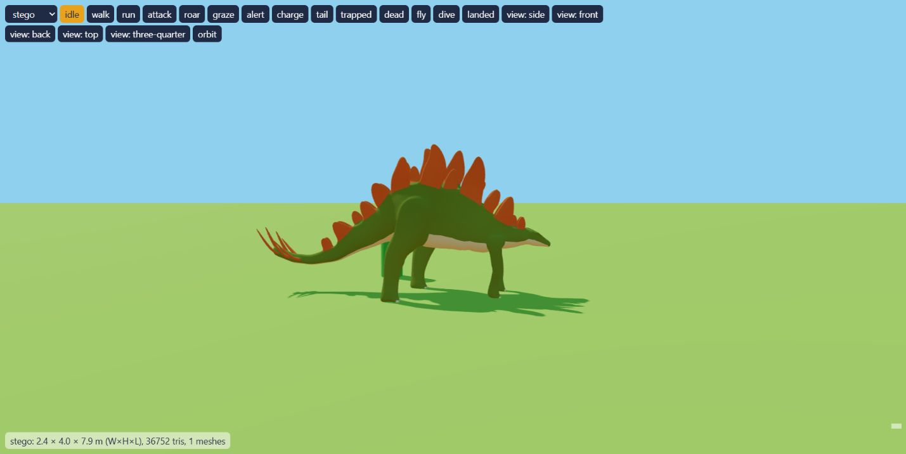

# Animated dinosaur verification

Branch: `codex/animated-dinosaur-models`. No push.

## Assets and mapping

CC0 pack: https://quaternius.com/packs/animateddinosaurs.html

| Game species | Pack model | Triangles | Height × length |
| --- | --- | ---: | --- |
| raptor | Velociraptor | 20,608 | 1.4 × 2.9 m |
| trex | T-Rex | 27,968 | 4.1 × 11 m |
| stego | Stegosaurus | 36,752 | 4 × 7.9 m |
| brachio | Apatosaurus | 22,960 | 11 × 19 m |
| ptera | Existing procedural model | 26,872 | Existing dimensions |

Parasaurolophus and Triceratops complete the six-species pack; their original
Blender files are retained but unused. There is no pteranodon in the pack.
All procedural builders and skins remain available if an imported model fails.

## Clips and state layers

Each imported species provides `<prefix>_Idle`, `_Walk`, `_Run`, `_Attack`,
`_Death`, and `_Jump`. Prefixes are `Velociraptor`, `TRex`, `Stegosaurus`,
and `Apatosaurus`. Apatosaurus's death clip is actually named
`Stegosaurus_Death` in the source; the catalog explicitly maps it.
Jump is exported but unused by the current server AI.

Idle/walk/run are selected from interpolated ground speed; charge selects run.
Attack/tail pulses select the authored attack once; death plays once and clamps.
Transitions crossfade over 0.18 seconds. Clip timescale is
`groundSpeed * clipDuration / strideMetres`. Strides are measured from median
grounded foot travel using `node scripts/measure-dino-strides.mjs`.

Roar, graze, alert and hurt have no authored clips: the mixer keeps the base
idle/locomotion pose while neck/head or body layers supply the motion. Trapped
uses idle, body struggle and foot movement. Post-mixer overlays use creature
axes rather than assuming the source bones' local axes. Tail follow-through
uses a substepped spring. Terrain following combines body pitch and two-bone
leg IK during stance, preserving swing arcs. Head tracking follows the local
camera in alert, charge and attack states.

## Verification

- `npm test`: 42 passing tests, including the original dinosaur visibility test.
- Actual GLBs parsed in Node without WebGL; tested instance independence,
  vertex colors, dimensions, triangle budgets, hit zones, every pose state,
  sloped ground, death clamping, and failed-load retries.
- Browser preview: all five species smoke-tested through idle, walk, run,
  attack, roar, graze, alert, charge, tail, trapped and dead. Ptera also tested
  through fly, dive and landed. No console warnings or errors.
- Solo mode: loading completed and the island/HUD appeared without console
  errors. Full combat and multiplayer play were not exercised in-browser.
- Preview `?type=stego&state=run&count=20`: 735,082 rendered triangles,
  approximately 6.1 ms frame interval and 1.28 ms animation CPU time in the
  desktop in-app browser. These are local preview measurements, not an island
  performance guarantee or a GPU profiler capture.

## Known limits

- Brachio uses Apatosaurus anatomy fitted independently to height, length and
  width. Its neck posture and leg proportions are not a true Brachiosaurus.
- The source skeletons have no separate jaw bones. Roar/jaw flags cannot visibly
  articulate a jaw with these assets. The loader supports an optional Jaw alias
  and optional roar/eat/hurt clips for future model providers.
- Foot IK is limited to modest terrain corrections; extremely steep terrain or
  snapshot discontinuities can still cause imperfect contact or sliding.
- Ptera stays procedural. Server species, AI, networking and combat rules are
  unchanged; hit spheres now follow imported bones on the four land species.

To inspect the result, run `npm start`, open
http://localhost:8080/src/client/models/dino/preview.html and select a species.
Use `count=20` for the repeatable performance scene.

