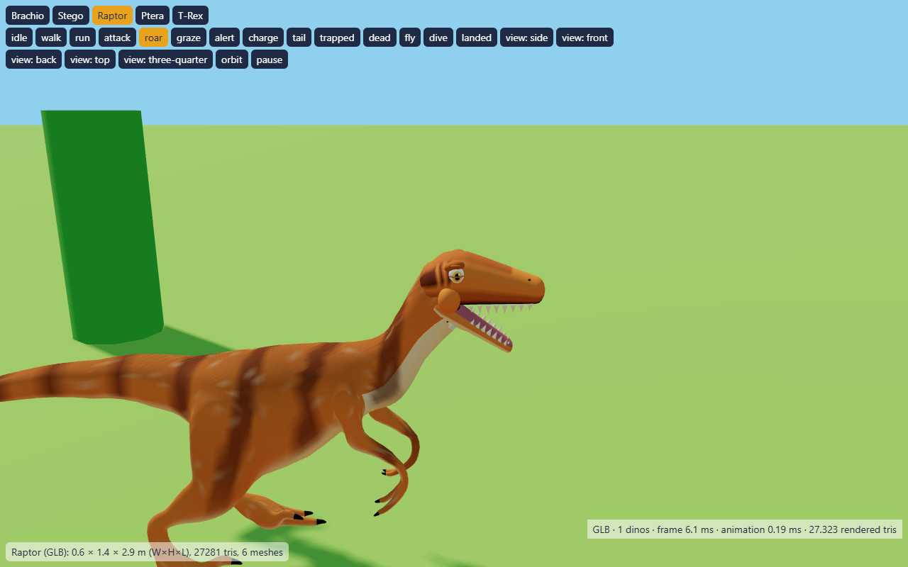
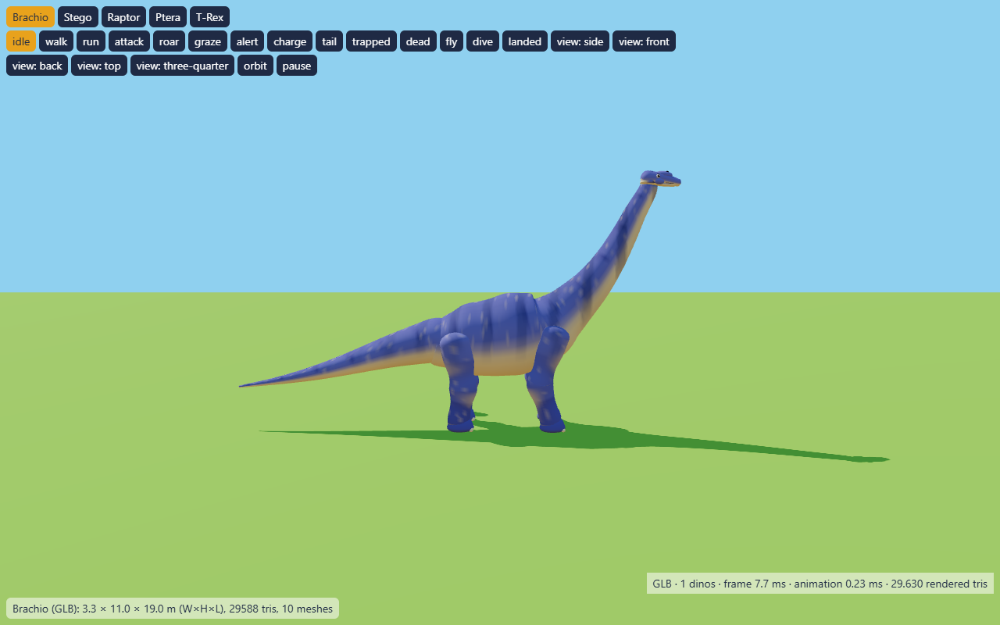
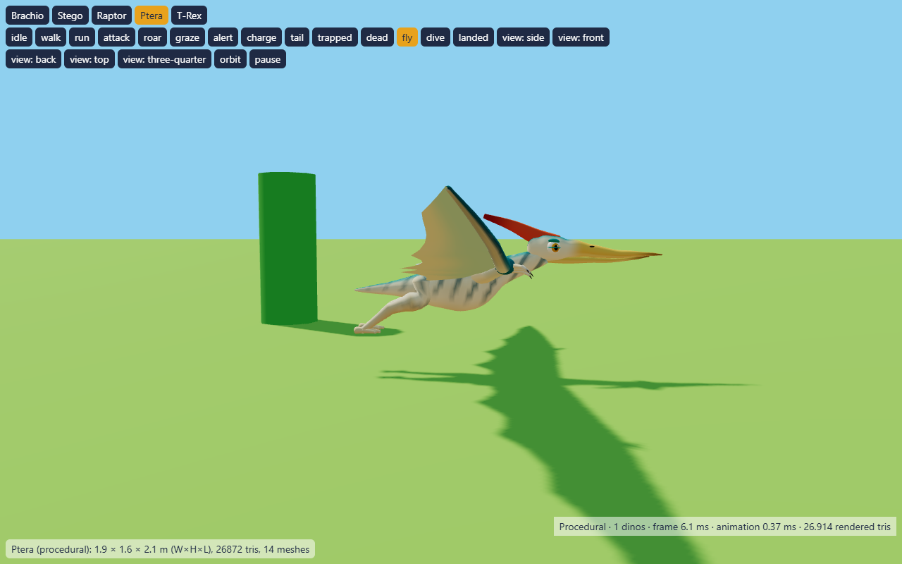

# Dinosaur appearance and animation verification

Branch: `codex/animated-dinosaur-models`. Local commits only; no push.

## Corrected defects

- Added readable eyes, pupils, highlights, brows, nostrils, cheeks and movable
  lower jaws to the imported Raptor, T-Rex and Stegosaurus heads. Removed the
  original fixed head surfaces so mouths do not contain a second jaw.
- Added rest-space vertex-color stripes, cream undersides and skin flecks.
  These markings deform with the skin; they are not bitmap texture maps.
- Removed the second runtime leg solver. The source foot targets are parented
  to the root rather than the knees, and their IK is already baked into clips.
  Solving that hierarchy again caused the leg distortion.
- Closed walk/run endpoints, smoothed sparse knee keys, and moderately retimed
  held sections. Walk/run transitions preserve cycle phase. Bounded cadence
  reduces the Raptor run from approximately 4.6 to at most 1.9 cycles/second.
- Replaced the vertically stretched Apatosaurus with a GLB baked from the
  project's Brachiosaurus geometry. It has its own neck proportions, periodic
  four-legged gaits, and a defensive stomp with a 0.8-second windup. The hind
  feet are planted during the windup; the front legs lift and return on impact.
- Corrected inward-facing triangle winding in procedural skin lofts. This
  fixes missing surfaces and inverted shading on Brachiosaurus and Ptera.
- Ptera now has larger eyes, patterned body skin, wing rays and pale wing-edge
  bands. Its procedural flight, dive and landing rig is retained.
- Added a preview pause/resume control and camera refitting on narrow screens.

## Assets

| Species | Geometry source | Triangles | Height × length |
| --- | --- | ---: | --- |
| Raptor | Quaternius Velociraptor plus project facial geometry | 27,281 | 1.4 × 2.9 m |
| T-Rex | Quaternius T-Rex plus project facial geometry | 25,882 | 4.1 × 11 m |
| Stego | Quaternius Stegosaurus plus project facial geometry | 41,216 | 4 × 7.9 m |
| Brachio | Project Brachiosaurus baked to GLB | 29,588 | 11 × 19 m |
| Ptera | Project procedural flight rig | 26,872 | Existing dimensions |

Original Quaternius assets remain CC0. Project additions retain the project's
license. Source Blend files are retained; Apatosaurus is now unused. Regeneration
commands are in `art/sources/quaternius-dinosaurs/README.md`.

## Verification, 2026-09-30

- `npm test`: 43 passing tests. The original visibility and co-op tests pass.
- Parsed actual GLBs and checked triangle counts, vertex colors, dimensions,
  clone independence, combat hit spheres and all pose inputs.
- Regression checks verify eyes/jaws, identical loop endpoints, no accumulated
  jaw rotation, bounded cadence, and no knee jumps over six seconds of running.
  An independent mixer gives identical leg rotations, proving the runtime
  layers do not overwrite baked leg poses. Loft normals face outward.
- Playwright Chromium: exercised all five species through idle, walk, run,
  attack, roar, death and return to idle. Also exercised Ptera flight, dive and
  landing. Rechecked the final assets and captured face close-ups and six poses
  spanning every land species' walking and running cycle. No page errors or
  failed model/module requests.
- Real UI clicks exercised rapid species changes while dead, pause/resume,
  and the 390 × 844 narrow viewport.
- 20 Stegosaurus instances: approximately 824,362 rendered triangles, 6.1 ms
  frame interval and 1.37 ms animation CPU time in the local Chromium preview.
  These are local preview measurements, not an island or hardware guarantee.

Reproduce browser checks with a running localhost:8080 server:

```
node scripts/check-dino-preview.mjs <playwright/index.mjs> [chromium.exe]
```

Screenshots, cycle contact sheets, a video, and result JSON are written under
`output/playwright/dino-revision/` (ignored by Git). The bundled Playwright was
used because the interactive MCP Node runtime failed to initialize. Installing
a separate copy was unnecessary; the attempted npm installation failed on a
registry certificate verification error, without changing package dependencies.

## Remaining limits

Server AI, networking, combat and movement speeds are unchanged. Terrain follows
body pitch; the incompatible per-foot solver is removed. Uneven ground can still
produce imperfect foot contact, and cadence caps can cause sliding at the highest
movement speeds. Full in-island combat and slope traversal were not visually
replayed during this revision. Automated tests and flat-ground preview checks
cannot establish that every possible gameplay animation is artifact-free.




